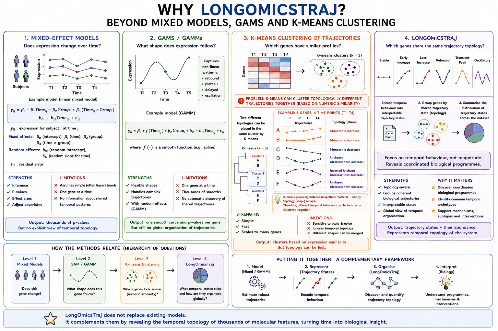

# LongOmicsTraj

LongOmicsTraj is an R package for representing longitudinal omics profiles as discrete trajectory topologies.

  

## Why LongOmicsTraj?

Longitudinal studies are often analysed using mixed-effects models, GAMs, or trajectory clustering. These methods test change, estimate smooth temporal patterns, or group genes by numerical similarity. LongOmicsTraj addresses a complementary question:

> Which genes share the same temporal behaviour?

The framework converts adjacent visit-to-visit changes into discrete trajectory states (e.g. up_up, down_up, flat_flat), enabling direct comparison of temporal behaviour across genes, pathways, treatments and cohorts.

## Installation
...
